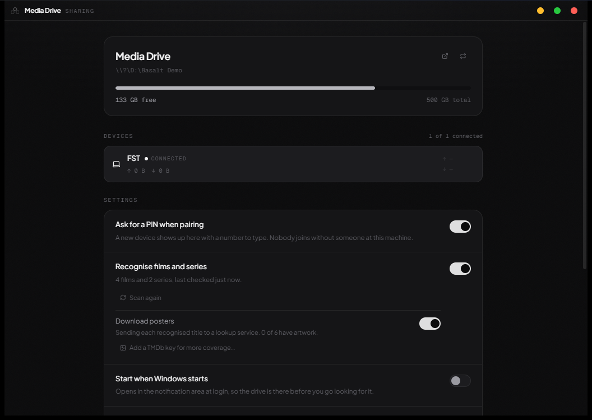
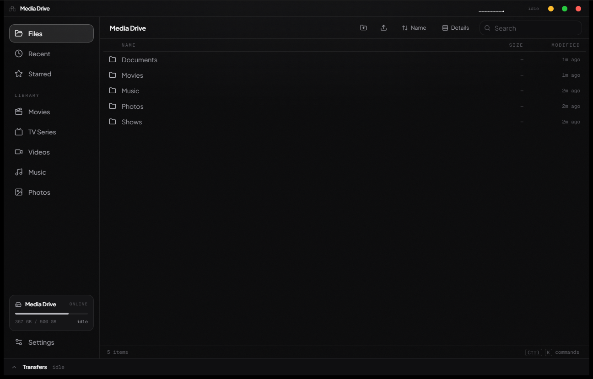
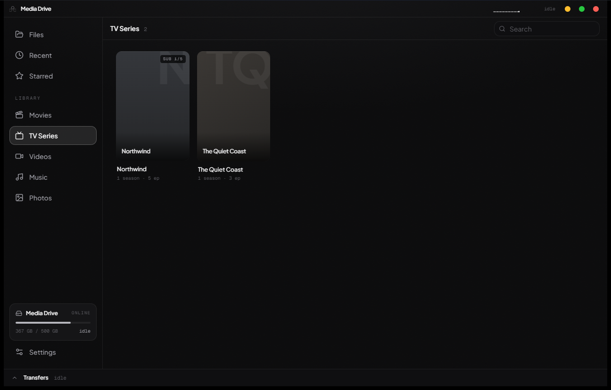
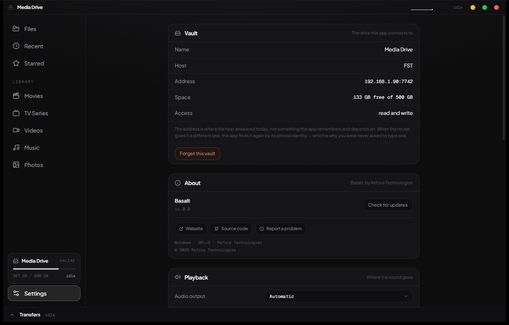

<div align="center">
  <h1>Basalt</h1>
  <p><b>One drive, on every device in the house. No addresses, no accounts, no setup.</b></p>
  <p>
    
    
    
    
  </p>
  <p>
    <a href="https://github.com/Dushmantha-Amarasinghe/basalt/releases/latest">Download</a> &nbsp;·&nbsp;
    <a href="https://reforatech.com">Refora Technologies</a>
  </p>
</div>

<br/>

## Overview

**Basalt** by Refora Technologies turns one spare machine into a drive your
other devices can use. It comes in two halves: **Basalt Host** runs on the
machine with the drive, and **Basalt** runs everywhere else.

The point of it is that there is nothing to configure. You pick a drive on the
host; on another device you pick the host from a list and read a PIN across.
That is the whole setup. No IP address is ever typed, no account is made, and
no Windows sharing settings are touched — your devices find the host by
themselves and keep finding it when the router hands it a different address,
because what they trust is its pinned identity rather than where it happens to
be today.

## Screenshots

<div align="center">
  
  
</div>
<div align="center">
  
  
</div>

## Key Features

- **Finds itself.** The host announces itself on the local network and the
  client lists what it finds. Pairing is a PIN read from one screen to the
  other, once. Addresses change freely afterwards and nothing breaks.
- **Pinned, encrypted, private.** Every connection is TLS 1.3, and the client
  pins the host's public key on first pairing — an imposter on the same network
  is refused rather than trusted. Nothing leaves your network, and there is no
  cloud account anywhere in the design.
- **Browse the whole drive.** Files, folders, search, copy, move, rename,
  delete, upload by drag-and-drop onto whichever folder you drop on. Transfers
  are compressed where that helps, batched for small files, and verified with
  BLAKE3 end to end.
- **Films and series, recognised.** Turn it on and the host reads the drive and
  files what it finds under Movies and TV Series, with seasons and episodes in
  order. Every film is checked against a bundled catalogue of released titles,
  so screen recordings and home videos stay out of Movies — offline, with
  nothing sent anywhere. Posters are optional and need no API key.
- **A real player.** Built on **mpv**, so it plays what a browser cannot —
  HEVC, E-AC3, DTS, MKV, and the rest — without the host transcoding anything.
  Click to pause, arrow keys to seek and change volume, `,` and `.` to step one
  frame at a time, subtitle track selection, subtitle files found on the drive,
  and a sync offset for subtitles that drift.
- **Carries on where you left off.** Resume points live on the host, not on the
  device, so you can start something on one machine and finish it on another —
  or, if the household prefers, each device keeps a history of its own.
  Episodes play on to the next one by themselves.
- **Live, both ways.** The host watches the drive itself, so a file added,
  renamed or deleted — by Basalt, by Explorer, or by anything else — reaches
  every connected device at once, and a new film or episode is filed under
  Movies or TV Series the moment it lands.
- **A drive that comes and goes.** Unplug the host's drive and it says so, on
  the host and on every device; plug it back in and it is shared again, with
  nothing to redo.
- **Several devices at once.** There is no device limit and no connection
  limit; the host serves bytes and nothing more, so more viewers cost it
  almost nothing.

## Technical Stack

| Part | Built with |
|---|---|
| Host and client cores | Rust 2024, Tokio |
| Transport | TCP, TLS 1.3 (rustls + ring), SPKI pinning, custom binary protocol |
| Discovery | UDP beacon on the local network |
| Desktop shells | Tauri v2, React 19, TypeScript, Tailwind, Framer Motion |
| Playback | libmpv |
| Integrity | BLAKE3 per transfer, SHA-256 on updates |

## Installation

Download the latest installers from the
[releases page](https://github.com/Dushmantha-Amarasinghe/basalt/releases/latest):

- **`Basalt-Host-x.y.z-setup.exe`** — on the machine with the drive.
- **`Basalt-Client-x.y.z-setup.exe`** — on every device that should reach it.

Both install per-user and need no administrator. Each release also publishes a
`.sha256` beside each installer if you want to check what you downloaded.

Then: open Basalt Host, pick a drive, and open Basalt on another device. It
will list the host; select it and type the PIN the host shows.

Both apps check for updates on their own and will tell you what is in the new
version before you install it.

## Configuration & Usage

Everything Basalt keeps lives in `%APPDATA%\Basalt\`:

| File | What it is |
|---|---|
| `host.json` | The host's identity, its settings and its paired devices |
| `client.json` | The vault this device is paired with |
| `host.log` | The host's log, replaced at each start |
| `library-*.json` | The media index, rebuilt by a scan |
| `progress-*.json` | Where each file was watched to |
| `art/` | Downloaded posters |

Deleting `host.json` regenerates the host's identity, which un-pairs every
device. The rest can be deleted freely.

**Optional, and off by default:** recognising films and series reads the whole
drive, and downloading posters sends each recognised title to a lookup service.
Neither happens until you turn it on.

## Building from source

```
rustup toolchain install stable          # Rust 1.98+ MSVC
cd apps/client/src-tauri && pwsh -File fetch-libmpv.ps1
cd apps/host/src-tauri   && pwsh -File fetch-libmpv.ps1
cd apps/client && npm install && npx tauri build
cd apps/host   && npm install && npx tauri build
```

`fetch-libmpv.ps1` downloads libmpv and a small wrapper into `src-tauri/lib/`
and verifies the wrapper's checksum. They are not in the repository because
`libmpv-2.dll` is 96 MB. The host uses the same libmpv to make thumbnails of
videos; its script copies the client's rather than downloading it again.

The host recognises films against a catalogue of every film and series title
on Wikidata, bundled so that it works offline and sends nothing anywhere. It is
committed at `crates/basalt-catalog/data/catalog.bin` (about 3 MB) and rebuilt
for each release with:

```
cargo run -p catalog-build --release
```

`cargo test --all` runs the Rust suite; `npm test` in either app runs its own.

## License

This project is licensed under the **GNU General Public License v3.0 (GPLv3)**.

You are free to use, modify and distribute this software, provided any
derivative works are also open-source under the identical terms. See the
`LICENSE` file for the complete terms.

Basalt bundles libmpv (LGPL-2.1-or-later) and links a number of open-source
libraries. See `THIRD-PARTY-NOTICES.txt` for full attribution.

---

<div align="center">
  <p>Crafted by <b>Refora Technologies</b></p>
  <p><a href="https://reforatech.com">reforatech.com</a></p>
</div>
